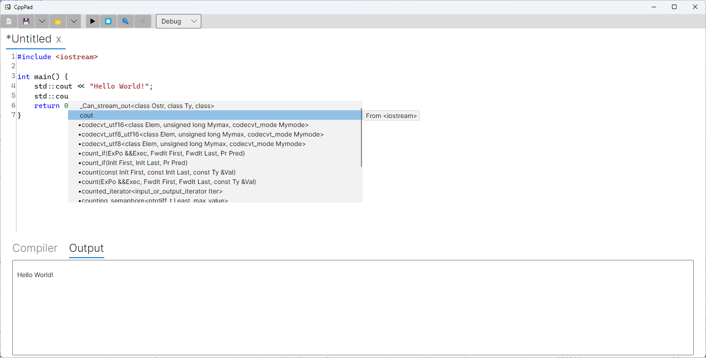

# CppPad

A minimal GUI for compiling and running C++ code. This is designed to be a simple test workbench for C++ code.

## Goals

Sometimes there is a need to create transient code to experiment with certain functions or to benchmark them. 
While there are great online tools like Compiler Explorer or Quick-Bench, they sometimes cannot be used to explore proprietary code without uploading it. 
Another option is to create a quick CMake project. 
However, it involves a few steps, such as creating a CMake file and temporary files with the source code to test.

The goal of CppPad is to provide an environment where one can experiment with code with as few steps as possible. 
For example, there is no need to save a file before compiling, as it will be saved in a temporary file automatically.

## Current Features

✅ Auto-completion\
✅ Configuration of include folders, static linked libraries, C++ standard, and other parameters\
✅ Saving and loading files\

## Missing Features

The following features are still missing:

⏳ Speed up the auto-completion\
⏳ Provide built releases\
⏳ Benchmark functionality\
⏳ File templates\
⏳ Navigate to definition\
⏳ Support for environments other than Windows and MSVC\
⏳ Automatically shelve the current document when closing the application\
⏳ Dark mode\
⏳ Show errors while editing\
⏳ Debugging (probably much later...)\

## Requirements

- .NET 9.0 or later

## Getting Started

1. Clone or download the repository.
2. Open the solution in Visual Studio or VS Code.
3. Build and run the CppPad.Gui project.

## License

Distributed under the MIT License. See [LICENSE.md](LICENSE.md) for details.

This project uses **Clang**, which is part of the LLVM Project and licensed under the Apache License v2.0 with LLVM Exceptions.\
The original Clang and LLVM source code is available at:\
[https://llvm.org/](https://llvm.org/)\
The Clang license can be found at:\
[https://llvm.org/LICENSE.txt](https://llvm.org/LICENSE.txt)
